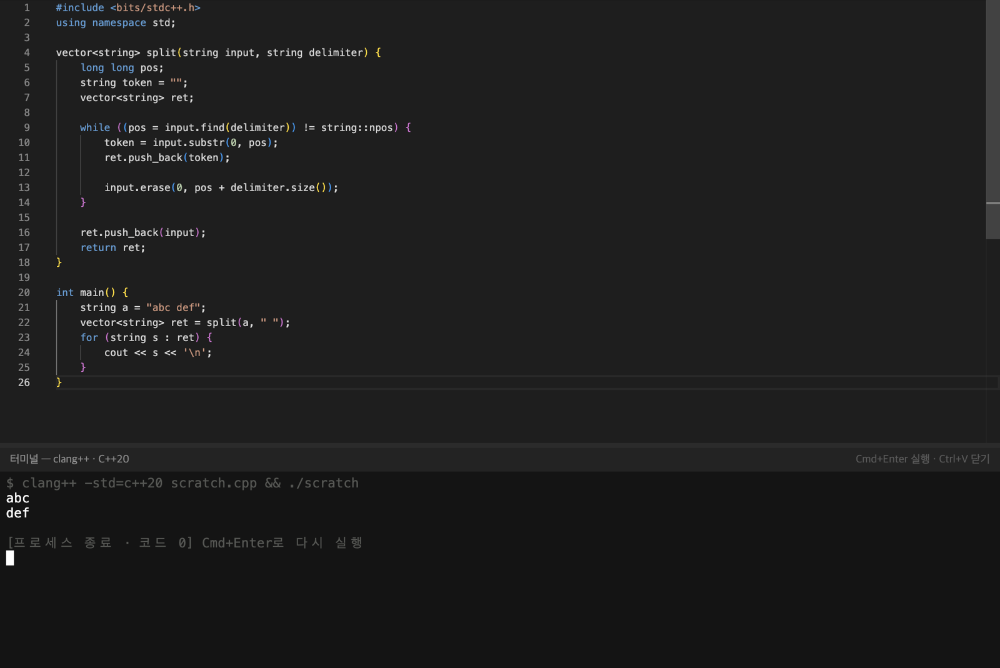
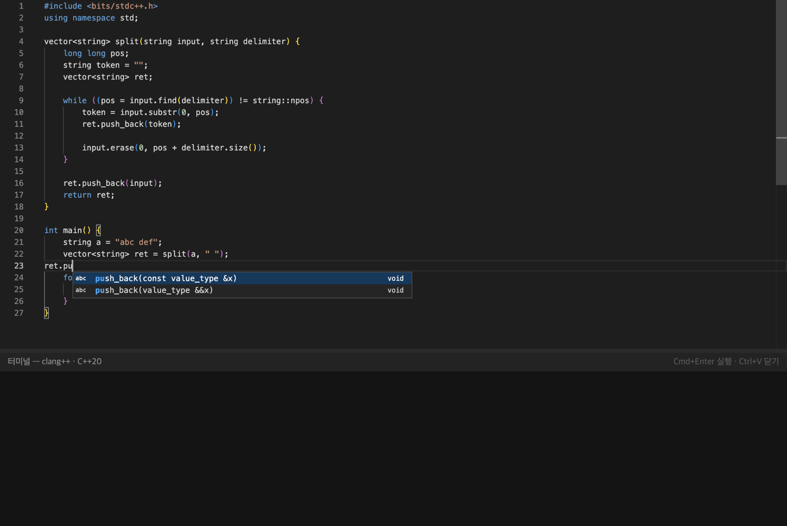
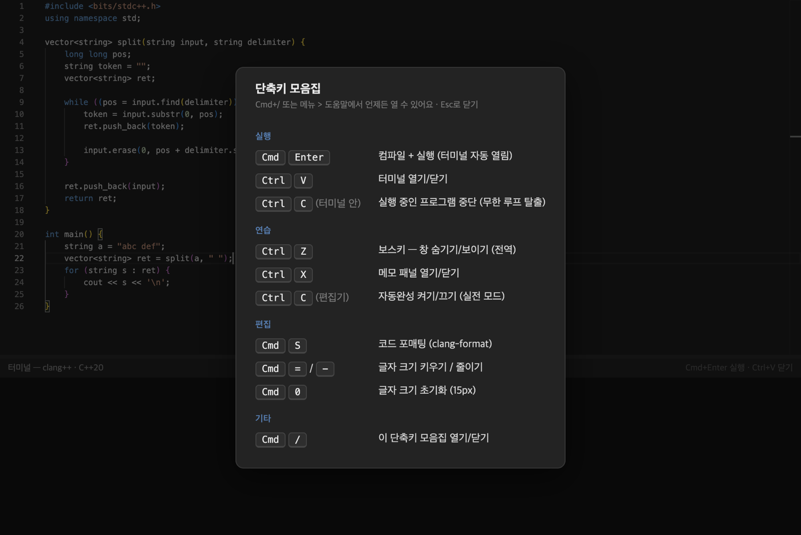

# 스크래치패드 (C++ 타이핑 연습용)

코딩테스트용 C++ 타이핑 연습 에디터.

> **macOS 전용 (Apple Silicon)** — Windows·Linux·Intel Mac은 지원하지 않습니다.
> 컴파일러·자동완성 도구는 앱에 들어 있지 않아 처음 한 번 설치가 필요합니다 (앱이 안내해 줌 — [처음 실행](#처음-실행--개발-도구-설치)).

## 동작 예시

### 컴파일 + 실행 (`Cmd+Enter`)

코드를 쓰다가 `Cmd+Enter`를 누르면 하단 터미널이 열리고 clang++(C++20)로 컴파일해 바로 실행된다.
PTY 기반이라 `cin` 입력도 터미널에 직접 칠 수 있다.



### C++ 자동완성 (clangd)

VS Code C++ 확장과 동일한 clangd 언어 서버가 붙어 있다. `ret.pu`까지만 쳐도
`push_back`의 오버로드 시그니처와 반환 타입까지 보여준다. `bits/stdc++.h` 기준으로 동작.

코테 사이트에는 자동완성이 없으므로 `Ctrl+C`로 끄고 실전 모드로 연습할 수 있다 (기본 상태 저장됨).



### 단축키 모음집 (`Cmd+Shift+/`)

단축키가 기억 안 나면 `Cmd+Shift+/`(`Cmd+?`) 또는 메뉴 > 도움말에서 언제든 열 수 있다.




### 템플릿 드릴 (`Ctrl+T`)

코테 템플릿을 저장해 두고 **보고 따라치기 → 가리고 백지 복원 → 채점**을 반복하는 기능.

1. `Ctrl+T` 라이브러리에서 템플릿을 저장·수정·삭제하거나, **레포에서 가져오기**로 study 레포의 `stage*/템플릿.md`를 한 번에 불러온다 (`## T0-1. 제목 (30초)` 헤더 + 아래 코드 블록)
2. **보고 따라치기** — 메모 패널 자리에 템플릿이 읽기 전용으로 뜬다 (원래 메모는 그대로 보관)
3. `Ctrl+R` **백지 복원** — 템플릿을 가리고 빈 에디터 + 타이머. 자동완성은 꺼지고, 쓰던 코드는 따로 보관했다가 끝나면 돌려놓는다
4. `Cmd+Shift+Enter` **제출** — 주석·공백·줄 바꿈·`#include` 순서는 무시하고 문장(`;`·블록 `{ }`) 단위로 비교해 diff로 보여준다. 한 줄에 몰아 쳐도, `Cmd+S`로 포맷해도 내용이 같으면 맞음
   - 내용 일치 + 목표 시간 안 = 성공. **내용이 맞아도 시간 초과면 연속 기록이 끊긴다**
   - 2연속 성공 = 졸업 ✓
   - 목표 시간이 빡빡하면 라이브러리에서 **수정** → 목표 시간을 바꾼다. 직접 바꾼 목표 시간은 레포에서 다시 가져와도 유지된다
5. `Esc` — 복원 포기 (기록 안 남음)

**템플릿.md 작성 가이드** — 라이브러리 왼쪽 아래 **작성 가이드** 버튼. 파일 위치·헤더 형식(`## T4-1. 이름 (3분)`)·흔한 실수(`###` 아래 코드 블록은 앞 템플릿에 합쳐짐 등)를 보여주고, 복붙용 뼈대와 **AI에게 붙여넣을 프롬프트**를 복사 버튼으로 제공한다. 프롬프트에 주제·STAGE 번호만 채워 Claude/ChatGPT에 주면 가져오기 형식에 맞는 템플릿.md가 나온다.

**템플릿.md 검사기** — 앱과 같은 파서(`template-parser.js`)로 파일을 읽어 템플릿 목록과 형식 경고를 보여준다. 코드가 앱 포맷(`Cmd+S`, `.clang-format`)과 다르면 경고하고, `--fix`면 그 모양으로 고친다. 경고가 있으면 종료 코드 1.

```bash
node scripts/check-template.js ~/woodie/study/coding-test        # 폴더 (stage*/템플릿.md 전부)
node scripts/check-template.js stage6-이분탐색/템플릿.md           # 파일 하나
node scripts/check-template.js --fix ~/woodie/study/coding-test  # 코드 블록을 앱 포맷으로 정리
```

잡는 실수: 앱 포맷과 다름 · 번호 뒤 마침표 빠짐 · 목표 시간 괄호 없음 · `###` 아래 코드 블록이 앞 템플릿에 합쳐짐 · 파일 제목과 번호의 STAGE 불일치 · 코드 블록 없는 헤더 · 번호 중복 · 안 닫힌 코드 블록

**템플릿 만들기 스킬 (Claude Code)** — [`.claude/skills/scratchpad-template/`](.claude/skills/scratchpad-template/SKILL.md). 주제만 주면 외워 칠 최소 골격을 가져오기 형식에 맞춰 템플릿.md로 쓰고, 검사기로 경고 0개까지 확인한다.

- 이 레포에서 Claude Code를 열면 자동으로 쓸 수 있다. 예: "STAGE 6으로 이분탐색 템플릿.md 만들어줘"
- 다른 폴더(예: study 레포)에서도 쓰려면 전역 스킬로 복사:

```bash
mkdir -p ~/.claude/skills && cp -R .claude/skills/scratchpad-template ~/.claude/skills/
```

템플릿과 시도 기록은 userData 폴더의 `templates.json`에 저장된다 (`~/Library/Application Support/scratchpad/`).

## 설치 (빌드된 앱)

[Releases](https://github.com/easyDong19/scratchpad/releases)에서 최신 `.dmg`를 받아 열고 `Scratchpad.app`을 `Applications` 폴더로 드래그.

ad-hoc 서명(공증 없음)이라 최초 실행 시 "확인되지 않은 개발자" 경고가 뜹니다 — **우클릭 > 열기**로 실행하거나, 안 되면:

```bash
xattr -dr com.apple.quarantine /Applications/Scratchpad.app
```

### 처음 실행 — 개발 도구 설치

에디터·메모 패널·템플릿 드릴은 설치 즉시 쓸 수 있습니다. **컴파일·실행(`Cmd+Enter`)과 자동완성**에는 아래 두 가지가 필요하고,
빠진 게 있으면 앱을 켤 때 **"시작하기 전에"** 화면이 떠서 설치를 안내합니다 (메뉴 > 도움말 > **개발 도구 환경 확인**에서 언제든 다시 열 수 있음).

| 도구 | 용도 | 설치 |
|---|---|---|
| Xcode 명령줄 도구 | 컴파일러 `clang++`, 자동완성 `clangd` | 안내 화면의 **설치 시작** 버튼 (= `xcode-select --install`) |
| GCC (Homebrew) | `#include <bits/stdc++.h>` 헤더 | 안내 화면의 명령을 복사해 터미널에 붙여넣기 (비밀번호 필요) |

GCC 설치 명령 (Homebrew가 없으면 [Homebrew](https://brew.sh)부터):

```bash
/opt/homebrew/bin/brew install gcc
```

설치 후 **다시 확인**을 누르면 앱을 다시 켜지 않아도 자동완성이 바로 붙습니다. 타이핑만 할 거라면 **나중에**로 넘기면 됩니다.

## 소스로 실행 / 빌드

```bash
npm install
npm start            # 개발 실행
npm run build        # dist/에 .app 패키징 (arm64)
npm run install:app  # /Applications에 설치
```

또는 Finder에서 `Scratchpad.command` 더블클릭.

## 단축키

| 키 | 기능 |
|---|---|
| `Cmd + Enter` | **컴파일 + 실행** — clang++(C++20)로 빌드해 하단 터미널에서 실행. 실행 중 `cin` 입력 가능 |
| `Ctrl + V` | **터미널** 열기/닫기 (터미널 안 `Ctrl+C`는 실행 중인 프로그램 중단) |
| `Cmd + Shift + /` | **단축키 모음집** 열기/닫기 (메뉴 > 도움말에서도 열림) |
| `Cmd + /` | 줄 주석 토글 |
| `Ctrl + Z` | **보스키** — 창 숨기기/보이기 (다른 앱을 쓰는 중에도 전역으로 동작) |
| `Ctrl + X` | **메모 패널** 열기/닫기 (정답 코드를 옆에 띄워놓고 따라 치기용) |
| `Ctrl + T` | **템플릿 라이브러리** — 저장·수정·삭제·레포에서 가져오기 |
| `Ctrl + R` | 보고 있는 템플릿으로 **백지 복원** 시작 |
| `Cmd + Shift + Enter` | 복원 **제출** → 채점 |
| `Esc` | 복원 포기 · 라이브러리/채점 창 닫기 |
| `Ctrl + C` | **자동완성 켜기/끄기** — 코테 사이트(프로그래머스 등)엔 자동완성이 없으므로 실전 모드 연습용. 상태는 저장됨 |
| `Cmd + =` / `Cmd + +` | 글자 크기 키우기 (최대 40px) |
| `Cmd + -` | 글자 크기 줄이기 (최소 8px) |
| `Cmd + 0` | 글자 크기 초기화 (15px) |

## 기능

- **C++ 문법 하이라이팅** (Monaco Editor — VS Code와 동일 엔진)
- **진짜 IDE 자동완성 (clangd 언어 서버)**: VS Code C++ 확장과 동일한 clangd가 붙어 있음
  - `#include <bits/stdc++.h>` 헤더 완성, `ios_base::` / `v.` 멤버 완성, `std::` 전체
  - 함수 시그니처 도움말(파라미터 표시), 호버 문서, 실시간 문법 오류 표시
  - GCC(Homebrew gcc 15)의 libstdc++ 헤더 사용 — `bits/stdc++.h` 그대로 동작
- **자동완성 토글 (Ctrl+C)**: 끄면 자동 팝업·수동 트리거(Ctrl+Space)·파라미터 힌트가 모두 비활성 — 문법 하이라이팅과 실시간 오류 표시는 유지 (맥에서 복사는 Cmd+C라 충돌 없음)
- **메모 패널 (Ctrl+X)**: 오른쪽에 참고용 편집기를 띄워 정답 코드를 보면서 왼쪽에 따라 칠 수 있음
  - C++ 하이라이팅은 되지만 자동완성·진단은 왼쪽 편집기 전용 (메모는 순수 참고용)
  - 경계선 드래그로 폭 조절, 열림 여부·폭·내용 모두 저장돼 재실행 시 복원
  - Ctrl+X로 열어도 키보드 포커스는 왼쪽에 남아 타이핑이 끊기지 않음
- **컴파일 + 실행 (Cmd+Enter)**: 하단 터미널(xterm.js + node-pty, 진짜 PTY)에서 clang++ `-std=c++20`으로 빌드·실행
  - 대화형 `cin` 입력 지원 — 실행 중 터미널에 직접 타이핑
  - 무한 루프는 터미널 안에서 `Ctrl+C`로 중단, 높이 드래그 조절·열림 상태 저장
- 작성 내용은 자동 저장되어 재실행 시 복원됨

## Programmers 기준 설정

- 언어 표준: **C++20** (`compile_flags.txt` 및 실행 컴파일 모두 `-std=c++20`)
- 표준 라이브러리: GCC libstdc++ (`bits/stdc++.h` 사용 가능, Programmers의 g++와 같은 라이브러리 계열)
- 포맷(Cmd+S): `.clang-format` — 4칸 들여쓰기, 같은 줄 중괄호, 줄 길이 제한 없음 (Programmers 기본 `solution()` 템플릿 스타일)
- 기본 템플릿: Programmers `int solution(vector<int> numbers)` 형식

## 환경 의존성

- macOS · Apple Silicon (arm64 빌드만 제공)
- Xcode Command Line Tools 또는 Xcode — `xcode-select -p`가 가리키는 툴체인의 `clang++`·`clangd`를 사용
- Homebrew GCC (`/opt/homebrew/opt/gcc`) — 앱이 켜질 때 설치된 GCC 버전·아키텍처를 찾아 clangd용 `compile_flags.txt`를 userData 폴더에 생성 (GCC·macOS 버전이 바뀌어도 수정 불필요)
- 레포의 [compile_flags.txt](compile_flags.txt)는 이 레포를 에디터로 열 때의 개발용 설정

## 참고

- macOS에서 실행 취소는 `Cmd+Z`라서 `Ctrl+Z`는 보스키로만 쓰임 (편집 기능과 충돌 없음)
- `Ctrl+Z`는 전역 단축키라 이 앱이 켜져 있는 동안 다른 앱에서의 `Ctrl+Z` 입력도 가로챔
